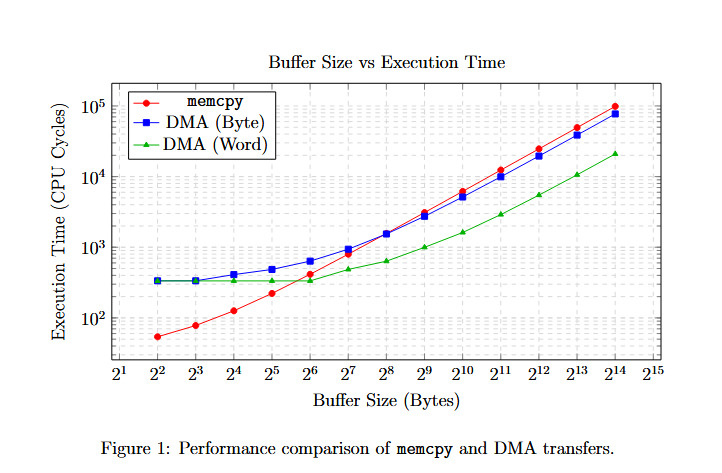

# Memcpy vs DMA Performance Analysis

## 📌 Objective
The goal of this assignment is to investigate and compare the execution speed of Direct Memory Access (DMA) against CPU-driven memory copying (`memcpy`) on the STM32F4 microcontroller. 

Due to the unavailability of a logic analyzer, the internal **Data Watchpoint and Trace (DWT) cycle counter** was utilized as a precise alternative to measure the execution time of each operation. Transfers were measured across varying buffer sizes ranging from 4 to 16,384 bytes. Furthermore, since all selected test sizes are strictly divisible by 4, it was possible to safely configure and evaluate the DMA using Word (32-bit) transfers.

---

## 📊 Results & Performance Chart

### Raw Execution Time Measurements (CPU Cycles)

| Buffer Size (Bytes) | Memcpy (Cycles) | DMA Byte (Cycles) | DMA Word (Cycles) |
|---------------------|-----------------|-------------------|-------------------|
| 4                   | 54              | 335               | 334               |
| 8                   | 78              | 335               | 334               |
| 16                  | 126             | 410               | 334               |
| 32                  | 222             | 485               | 334               |
| **64** | **414** | 636               | **334** |
| 128                 | 798             | 938               | 485               |
| **256** | **1566** | **1540** | 635               |
| 512                 | 3102            | 2742              | 997               |
| 1024                | 6174            | 5142              | 1617              |
| 2048                | 12377           | 9928              | 2901              |
| 4096                | 24665           | 19529             | 5467              |
| 8192                | 49360           | 38701             | 10602             |
| 16384               | 98686           | 77077             | 20928             |

---

## 🔬 Analysis & Conclusion

Based on the collected data, the following conclusions can be drawn:

* **Small Buffers:** The CPU (`memcpy`) is significantly faster for very small buffer sizes. This is due to the inherent DMA initialization overhead (configuring registers, setting flags), which consumes approximately 334 cycles regardless of the payload size.
* **Efficiency Threshold:** Hardware DMA outpaces the CPU at specific thresholds:
  * For DMA configured with **Byte-level alignment**, it becomes faster than `memcpy` at **256 bytes**. 
  * Optimal DMA usage involves **Word (32-bit) alignment**, which beats the CPU as early as **64 bytes**.
* **Large Buffers:** As the buffer size increases, the constant setup overhead of the DMA controller becomes negligible. At 16,384 bytes, DMA (Word) is nearly **5 times faster** than standard `memcpy` (20,928 cycles vs 98,686 cycles) because the hardware matrix transfers 32 bits concurrently without fetching CPU instructions.